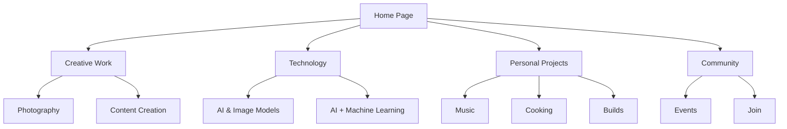
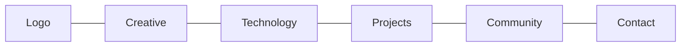

# "It's Nick" Website Restructuring Plan

## Overview

This document outlines the plan to transform the current single-page "It's Nick" website into a multi-page structure that maintains visual cohesion while giving each section room to breathe and expand.

## Proposed Site Structure

The content will be organized into 5 main pages with logical groupings:



### Page Structure Details

1. **Home Page (index.html)**
   - Hero section with dynamic text
   - Brief introduction
   - Featured content from each section
   - Navigation cards to main category pages
   - Call-to-action

2. **Creative Work (creative.html)**
   - Photography section
   - Content Creation section
   - Portfolio examples
   - Services offered

3. **Technology (tech.html)**
   - AI & Image Models section
   - AI + Machine Learning section
   - Projects showcase
   - Technical capabilities

4. **Personal Projects (projects.html)**
   - Music section
   - Cooking (Food, Science, and Fire) section
   - Builds section
   - Personal gallery

5. **Community (community.html)**
   - Events information
   - Community initiatives
   - Sign-up forms
   - Calendar

## Navigation Structure

A persistent header with navigation will appear on all pages:



The navigation will be responsive, collapsing to a hamburger menu on mobile devices.

## Visual Design Strategy

To maintain cohesion while making each section unique:

1. **Shared Elements**
   - Consistent color palette based on current dark theme
   - Same typography and base styling
   - Persistent header and footer
   - Consistent card and section styling

2. **Unique Elements per Page**
   - Subtle background pattern variations
   - Section-specific accent colors
   - Custom hero images for each main page
   - Tailored animations relevant to the page content

## Technical Implementation Plan

1. **File Structure**
```
itsnick/
├── index.html           # Home page
├── creative.html        # Creative Work page
├── tech.html            # Technology page
├── projects.html        # Personal Projects page
├── community.html       # Community page
├── css/
│   ├── styles.css       # Common styles
│   ├── home.css         # Home-specific styles
│   ├── creative.css     # Creative-specific styles
│   ├── tech.css         # Tech-specific styles
│   ├── projects.css     # Projects-specific styles
│   └── community.css    # Community-specific styles
├── js/
│   ├── common.js        # Shared functionality
│   ├── home.js          # Home-specific scripts
│   ├── creative.js      # Creative-specific scripts
│   ├── tech.js          # Tech-specific scripts
│   ├── projects.js      # Projects-specific scripts
│   └── community.js     # Community-specific scripts
└── assets/
    ├── images/          # Image assets
    └── fonts/           # Font files
```

2. **Common Components**
   - Header with navigation
   - Footer with social links
   - Card components
   - Section layouts
   - Typography styles
   - Animation utilities

3. **Page-Specific Components**
   - Custom hero sections
   - Page-specific content layouts
   - Specialized interactive elements

## Implementation Steps

1. **Setup Phase**
   - Create the file structure
   - Extract common CSS to shared stylesheet
   - Create page-specific CSS files
   - Split JavaScript functionality

2. **Common Components Phase**
   - Implement header with navigation
   - Implement footer
   - Create reusable components

3. **Page Development Phase**
   - Develop home page
   - Develop creative work page
   - Develop technology page
   - Develop personal projects page
   - Develop community page

4. **Enhancement Phase**
   - Add page transitions
   - Implement page-specific animations
   - Optimize images and assets
   - Add responsive refinements

5. **Testing Phase**
   - Cross-browser testing
   - Responsive design testing
   - Performance optimization
   - Link validation

## Additional Enhancements

1. **SEO Improvements**
   - Page-specific meta tags
   - Structured data markup
   - Sitemap creation

2. **Performance Optimizations**
   - Lazy loading for images
   - Code splitting for JavaScript
   - CSS optimization

3. **Accessibility Enhancements**
   - ARIA attributes
   - Keyboard navigation
   - Screen reader compatibility

## Key HTML Structure Changes

### Header Component (to be included in all pages)
```html
<header class="site-header">
  <div class="header-container">
    <a href="index.html" class="logo">It's Nick<span class="accent">.</span></a>
    <nav class="main-nav">
      <ul>
        <li><a href="creative.html">Creative Work</a></li>
        <li><a href="tech.html">Technology</a></li>
        <li><a href="projects.html">Personal Projects</a></li>
        <li><a href="community.html">Community</a></li>
      </ul>
    </nav>
    <button class="mobile-menu-toggle">Menu</button>
  </div>
</header>
```

### Footer Component (to be included in all pages)
```html
<footer id="footer">
  <div class="footer-content">
    <div class="footer-left">
      <h3>It's Nick. A little bit of everything.</h3>
    </div>
    <div class="footer-right">
      <a href="#" class="cta-button">Book a Call</a>
      <div class="social-links">
        <a href="#" class="social-link">Instagram</a>
        <a href="#" class="social-link">Twitter</a>
        <a href="#" class="social-link">LinkedIn</a>
      </div>
    </div>
  </div>
</footer>
```

## CSS Restructuring

The current CSS will be split into:

1. **Base Styles (styles.css)**
   - CSS variables
   - Typography
   - Layout fundamentals
   - Common components (cards, buttons)
   - Header and footer
   - Responsive basics

2. **Page-Specific Styles**
   - Hero variations
   - Section customizations
   - Page-specific animations
   - Unique visual elements

## JavaScript Restructuring

1. **Common Functionality (common.js)**
   - Navigation handling
   - Intersection observers
   - Shared animations
   - Utility functions

2. **Page-Specific Scripts**
   - Dynamic text rotation (home page)
   - Gallery functionality (creative page)
   - Technical demos (tech page)
   - Media players (projects page)
   - Event calendar (community page)

## Conclusion

This restructuring will transform the "It's Nick" website from a single-page format to a multi-page website with improved organization, better user experience, and more room for content expansion while maintaining the distinctive visual identity and interactive elements that make the site engaging.